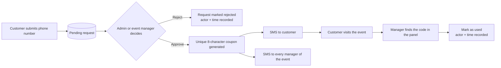

# Coupon Request Manager

**A WordPress plugin for running event-based discount campaigns — customers request a coupon, admins or event managers approve it, and everything is delivered and verified by SMS.**


-0d2846)

Coupon Request Manager turns a simple "get a discount code" button on your site into a complete, auditable workflow:

1. A customer enters their mobile number to request a discount for an event.
2. An administrator — **or the event's own manager, from a dedicated front-end panel** — approves or rejects the request.
3. On approval, a unique 8-character coupon code is generated and sent by SMS to the customer and to every manager of that event.
4. When the customer shows up, the manager looks the code up on their phone and marks it as used. No WordPress login required.

> **Language note:** the user interface (customer form, manager panel, admin screens) is written in Persian and laid out right-to-left. SMS delivery is built for [Melipayamak](https://www.melipayamak.com/) and Iranian mobile numbers. See [Known limitations](#known-limitations).

---

## Table of contents

- [Features](#features)
- [How it works](#how-it-works)
- [Requirements](#requirements)
- [Installation](#installation)
- [Configuration](#configuration)
  - [1. SMS gateway settings](#1-sms-gateway-settings)
  - [2. Melipayamak templates](#2-melipayamak-templates)
  - [3. Create an event](#3-create-an-event)
  - [4. Add the shortcodes to your pages](#4-add-the-shortcodes-to-your-pages)
- [Usage](#usage)
  - [For customers](#for-customers)
  - [For administrators](#for-administrators)
  - [For event managers](#for-event-managers)
- [Shortcode reference](#shortcode-reference)
- [Security model](#security-model)
- [Database schema](#database-schema)
- [Developer guide](#developer-guide)
- [Troubleshooting](#troubleshooting)
- [Known limitations](#known-limitations)
- [Roadmap](#roadmap)
- [Contributing](#contributing)
- [Changelog](#changelog)
- [License](#license)

---

## Features

### Customers
- One-tap **"get discount code"** button that opens a modal request form (shortcode).
- Iranian mobile number validation, with automatic normalization of Persian/Arabic digits and `+98` / `0098` / `98` prefixes.
- Duplicate protection — a customer cannot have two pending requests for the same event.
- Coupon delivered by SMS as soon as it is approved.

### Administrators
- **Requests list** with search and status filtering (pending / approved / rejected); approve or reject in one click.
- **Events management** — name, discount percentage, expiry date, availability toggle, and one or more managers per event.
- **Issued coupons list** with search, plus **Retry SMS** and **Mark as used** actions.
- **Melipayamak settings** screen — username, password and three template IDs, all configurable from the dashboard (nothing is hard-coded).
- Events that already have issued coupons cannot be deleted.

### Event managers (no WordPress account needed)
- **Phone number + SMS one-time-code login** — managers never touch `wp-admin`.
- A mobile-first, RTL front-end panel placed on any page with a single shortcode.
- **Dashboard counters:** pending requests, approved requests, unused coupons, coupons used today.
- **Requests tab:** search by customer phone, filter by status and date, approve or reject.
- **Coupons tab:** search by coupon code or customer phone, filter used/unused, **mark as used** with one tap.
- **Multiple managers per event.** Every assigned manager receives the coupon SMS and can log in; each sees only the events they are assigned to.

### Under the hood
- Server-side ownership checks on every manager action — knowing an ID is never enough.
- Hashed, rate-limited, single-use login codes and hashed session tokens (see [Security model](#security-model)).
- **Audit log** of approvals, rejections, usage and SMS retries, recording *who* did it (admin or manager) and *when*.
- Versioned database migrations that upgrade existing installations automatically.

---

## How it works



Two kinds of people can act on a request or coupon:

| Actor | Signs in with | Works in | Sees |
|---|---|---|---|
| **Administrator** | WordPress account (`manage_options`) | `wp-admin` | Everything |
| **Event manager** | Phone number + SMS code | Front-end panel (`[crm_manager_panel]`) | Only their own events |

---

## Requirements

| Component | Minimum |
|---|---|
| PHP | 7.3 (uses `setcookie()` options array and `random_int()`) |
| WordPress | 5.0 |
| MySQL / MariaDB | MySQL 5.7 / MariaDB 10.3 or newer recommended (uses `GET_LOCK()` and `DATETIME` defaults) |
| SMS provider | A [Melipayamak](https://www.melipayamak.com/) account with **pattern (template) based** sending |
| Network | Outbound HTTPS access to `rest.payamak-panel.com` |
| Site | HTTPS strongly recommended (the manager session cookie is marked `Secure` on HTTPS) |

---

## Installation

The plugin folder **must be named `coupon-request-manager`**.

### Option A — Clone directly (recommended for developers)

```bash
cd wp-content/plugins
git clone https://github.com/YOUR-USERNAME/coupon-request-manager.git coupon-request-manager
```

Passing the folder name as the last argument guarantees the correct directory name regardless of the repository name.

### Option B — Upload a ZIP

1. Create a ZIP whose top-level folder is `coupon-request-manager` and which contains `coupon-request-manager.php`, `includes/` and `assets/`.
2. In WordPress go to **Plugins → Add New → Upload Plugin**, choose the ZIP, and click **Install Now**.

> **Heads-up:** GitHub's *Code → Download ZIP* produces a folder named like `coupon-request-manager-main`. Rename it to `coupon-request-manager` before zipping, or WordPress will install it under the wrong directory name.

### Activate

Click **Activate** on the Plugins screen. Activation creates all database tables automatically. If you ever restore a database backup or replace the plugin files, see [Tables are missing after a restore](#tables-are-missing-after-a-database-restore-or-update).

---

## Configuration

### 1. SMS gateway settings

Go to **درخواست‌های تخفیف → تنظیمات ملی‌پیامک** (*Coupon requests → Melipayamak settings*) and fill in:

| Field | Option name | Purpose |
|---|---|---|
| Username | `crm_melipayamak_username` | Melipayamak account username |
| Password | `crm_melipayamak_password` | Melipayamak account password |
| Customer template ID | `crm_melipayamak_body_id_customer` | Message that delivers the coupon to the customer |
| Manager template ID | `crm_melipayamak_body_id_manager` | Message that notifies managers of a new coupon |
| Manager login template ID | `crm_melipayamak_body_id_manager_otp` | Message that carries the manager login code |

### 2. Melipayamak templates

Create three **pattern-based** templates in your Melipayamak panel and wait for them to be **approved** — an unapproved pattern may be accepted by the API but never delivered. Placeholders are positional, so **the order in your pattern must match the table below exactly**.

| Template | Placeholder `{0}` | Placeholder `{1}` |
|---|---|---|
| **Customer coupon** | Coupon code | Event name |
| **Manager notification** | Customer phone number | Coupon code |
| **Manager login code** | 6-digit login code | *(none — exactly one placeholder)* |

Example patterns (adapt the wording to your brand):

```text
Customer:  کد تخفیف شما: {0}  |  رویداد: {1}
Manager:   درخواست کننده: {0}  |  کد تخفیف: {1}
Login:     کد ورود شما به پنل مدیر رویداد: {0}
```

> If you need to change the argument order to fit an existing template, edit the `$args` array in `CRM_Manager_Ajax::request_otp()` (login code) or in `CRM_DB::approve_request()` (customer and manager messages).

### 3. Create an event

Go to **درخواست‌های تخفیف → لیست رویدادها** (*Events*) and add an event:

| Field | Description |
|---|---|
| Name | Shown to customers in the request modal |
| Discount value | Percentage, shown as "N درصد" |
| Manager phone numbers | **One or more** Iranian mobile numbers — separate with new lines, commas or semicolons. Every number becomes a manager of this event |
| Expiry date | After this moment the event no longer accepts requests |
| Availability | Toggle to pause an event without deleting it |

Manager numbers are normalized and de-duplicated on save. A manager who is assigned to several events sees all of them in a single panel.

### 4. Add the shortcodes to your pages

| Page | Shortcode |
|---|---|
| Public page where customers request a coupon | `[coupon_request_form]` |
| A separate page for event managers | `[crm_manager_panel]` |

Keep them on **separate pages** — each loads its own CSS/JS bundle. The manager page can be left out of your navigation menu; access is controlled by the SMS login, not by page visibility. See [Shortcode reference](#shortcode-reference) for options and caching advice.

---

## Usage

### For customers

1. Click **دریافت کد تخفیف** on the page.
2. Enter a mobile number (`09xxxxxxxxx`) and submit.
3. Wait for approval. The coupon code arrives by SMS.

### For administrators

Everything lives under the **درخواست‌های تخفیف** menu in `wp-admin`:

- **لیست درخواست‌ها** — review pending requests; approve or reject.
- **لیست رویدادها** — create, edit and delete events and their managers.
- **کدهای تخفیف صادر شده** — search issued coupons, **retry** a failed SMS, or **mark as used**.
- **تنظیمات ملی‌پیامک** — gateway credentials and template IDs.

Approving a request generates the coupon, records who approved it, and sends the SMS messages. If SMS delivery fails, the coupon still exists and a **Retry** button appears in the coupons list.

### For event managers

1. Open the manager page and enter the phone number registered on the event.
2. Enter the 6-digit code received by SMS. The code is valid for **3 minutes**.
3. Use the panel:
   - **Dashboard** — live counters at the top.
   - **Requests** — approve or reject requests for your events.
   - **Coupons** — type a coupon code or customer phone number, then tap **Mark as used** when the customer redeems it.

The session lasts **24 hours** on that device, so a page reload doesn't log you out. Use the logout button on shared devices.

---

## Shortcode reference

### `[coupon_request_form]`

Renders the request button and modal.

| Attribute | Default | Description |
|---|---|---|
| `event_id` | `0` | Show a specific event. If omitted (or not found) the most recent available, non-expired event is used |

```text
[coupon_request_form]
[coupon_request_form event_id="3"]
```

If no event is currently active, a short "no active event" notice is shown instead of the button.

### `[crm_manager_panel]`

Renders the manager login screen, or the panel when a valid session cookie is present. It takes no attributes.

> **Caching:** exclude the manager page from any page-cache or CDN cache (WP Rocket, LiteSpeed Cache, Cloudflare "Cache Everything", etc.). The page embeds a per-load nonce and reads the session cookie on the server; a cached copy causes stale nonces and a wrong initial screen.

---

## Security model

| Area | Implementation |
|---|---|
| **Manager login codes** | Random 6-digit code from `random_int()`. Only an HMAC-SHA256 hash (keyed with `wp_salt('auth')`) is stored — never the code itself |
| **Code lifetime & limits** | Valid for 3 minutes · maximum 5 verification attempts · 60-second resend cooldown · maximum 3 requests per hour per phone |
| **Single use** | A code is consumed by one atomic conditional `UPDATE`; two simultaneous verifications of the same code cannot both succeed |
| **Race protection** | A per-phone MySQL `GET_LOCK()` serializes concurrent code requests so the cooldown and hourly cap cannot be bypassed by parallel requests |
| **Failed SMS sends** | The code is invalidated, but the request record is **kept** so failures still count towards the rate limits |
| **Sessions** | 256-bit random token; only its SHA-256 hash is stored server-side. Delivered in an `HttpOnly`, `SameSite=Lax` cookie (`Secure` over HTTPS) valid for 24 hours |
| **Identity** | The manager's phone is always derived from the server-side session — a phone number sent in a request is never trusted for authorization. Access ends immediately if the manager is removed from all events |
| **Ownership** | Every approve, reject and mark-used action verifies the manager is assigned to that request's/coupon's event before doing anything |
| **State checks** | Only requests that are still `pending` can be approved or rejected |
| **CSRF** | Separate nonces for the public form, admin screens and manager panel |
| **SQL** | All queries use `$wpdb->prepare()`; interpolated IDs come from integer-cast values |
| **XSS** | Manager panel renders all data through `.text()` — no raw HTML injection |
| **Auditing** | Approvals, rejections, coupon usage and SMS retries are written to `coupon_manager_audit` with actor, event, target and timestamp |

---

## Database schema

Seven tables are created with your WordPress table prefix (shown here as `wp_`). Schema changes are applied through `dbDelta()` plus guarded `ALTER TABLE` migrations.

| Table | Purpose |
|---|---|
| `wp_coupon_available_events` | Events: name, discount %, expiry, availability, legacy `event_manager_phone` |
| `wp_coupon_event_managers` | Event ↔ manager membership (many-to-many, unique per `event_id` + `manager_phone`) |
| `wp_coupon_pending_requests` | Customer requests with status (`pending` / `approved` / `disapproved`) and rejection attribution |
| `wp_coupon_coupons` | Issued coupons: code, usage state and timestamp, who approved, who used, SMS-sent flag |
| `wp_coupon_manager_otps` | Manager login codes (hash only), expiry, attempt count — also the rate-limit history |
| `wp_coupon_manager_sessions` | Manager sessions (token hash only) with expiry |
| `wp_coupon_manager_audit` | Audit trail of actions by admins and managers |

`coupon_available_events.event_manager_phone` is a **legacy compatibility column**. It is kept in sync with the first manager and is still honoured as a fallback, so events created before multi-manager support keep working.

---

## Developer guide

### Repository layout

```text
coupon-request-manager/
├── coupon-request-manager.php        # Bootstrap: constants, includes, activation, migrations, asset enqueue
├── includes/
│   ├── class-db.php                  # CRM_DB — all table definitions, migrations and data access
│   ├── class-phone-helper.php        # CRM_Phone_Helper::normalize() — the only phone normalizer
│   ├── class-coupon-generator.php    # CRM_Coupon_Generator — unique 8-character codes
│   ├── class-melipayamak.php         # CRM_Melipayamak — SMS gateway client
│   ├── class-ajax.php                # CRM_Ajax — public request form + admin AJAX
│   ├── class-manager-ajax.php        # CRM_Manager_Ajax — manager login, session and panel endpoints
│   ├── class-admin.php               # CRM_Admin + list tables — wp-admin screens and actions
│   ├── class-shortcode.php           # [coupon_request_form]
│   └── class-manager-shortcode.php   # [crm_manager_panel]
└── assets/
    ├── css/  admin.css · frontend.css · manager.css
    ├── js/   admin.js  · frontend.js  · manager.js
    └── icons/discount-icon.svg
```

### AJAX endpoints

| Action | Nonce | Access | Purpose |
|---|---|---|---|
| `crm_submit_request` | `crm_frontend_nonce` | Public | Submit a coupon request |
| `crm_retry_otp` | `crm_admin_nonce` | `manage_options` | Re-send coupon SMS |
| `crm_mark_coupon_used` | `crm_admin_nonce` | `manage_options` | Mark a coupon used (admin) |
| `crm_manager_request_otp` | `crm_manager_nonce` | Public | Send a login code to a registered manager |
| `crm_manager_verify_otp` | `crm_manager_nonce` | Public | Verify the code and start a session |
| `crm_manager_logout` | `crm_manager_nonce` | Session | End the session |
| `crm_manager_get_dashboard` | `crm_manager_nonce` | Session | Dashboard counters |
| `crm_manager_get_requests` | `crm_manager_nonce` | Session | List/filter the manager's requests |
| `crm_manager_approve_request` | `crm_manager_nonce` | Session + ownership | Approve a request |
| `crm_manager_disapprove_request` | `crm_manager_nonce` | Session + ownership | Reject a request |
| `crm_manager_get_coupons` | `crm_manager_nonce` | Session | List/search the manager's coupons |
| `crm_manager_mark_coupon_used` | `crm_manager_nonce` | Session + ownership | Mark a coupon used |

Manager endpoints are registered for both `wp_ajax_` and `wp_ajax_nopriv_` because managers are not WordPress users; authorization is the session + ownership check inside each handler. Admin approve/reject/delete-event actions are nonce-protected `GET` links handled on `admin_init`.

### Shared business logic

Approve, reject and mark-used are implemented once and shared by the admin screens and the manager panel:

- `CRM_DB::approve_request( $request_id, $actor_type, $identifier )`
- `CRM_DB::disapprove_request( $request_id, $actor_type, $identifier )`
- `CRM_DB::mark_coupon_as_used( $coupon, $datetime, $used_by_phone, $used_by_role )`
- `CRM_DB::insert_manager_audit( ... )`

`$actor_type` is `'admin'` or `'manager'`; attribution and audit rows are written automatically.

### Options

`crm_melipayamak_username`, `crm_melipayamak_password`, `crm_melipayamak_body_id_customer`, `crm_melipayamak_body_id_manager`, `crm_melipayamak_body_id_manager_otp`, `crm_db_version`.

### Database versioning

`CRM_DB_VERSION` is compared with the stored `crm_db_version` option on `plugins_loaded`; when they differ, `create_tables()` and `migrate()` run and the option is updated. Activation always runs both unconditionally. **Any schema change must bump `CRM_DB_VERSION` and be made idempotent** (check with `column_exists()` / `table_exists()` before altering).

### Conventions

- All data access is static methods on `CRM_DB`, using `$wpdb->prepare()` placeholders.
- `CRM_Phone_Helper::normalize()` is the **single** phone normalizer — never re-implement it.
- Every AJAX handler starts with `check_ajax_referer()` and answers with `wp_send_json_success()` / `wp_send_json_error()`.
- Multi-step writes use explicit `START TRANSACTION` / `COMMIT` / `ROLLBACK`.
- **Time comparisons for login codes and sessions use the database clock** (`NOW()`), on both the stored value and the comparison, to avoid PHP/WordPress timezone drift. Do not mix `wp_date()` with `current_time()` when comparing expiries.
- `wp_localize_script()` object names and JS references must match exactly (`crm_data`, `crm_admin_data`, `crm_manager_data`, each with `ajax_url` and `nonce`).
- User-facing strings are Persian and every screen is RTL.

---

## Troubleshooting

### Tables are missing after a database restore or update

Restoring a backup can leave `crm_db_version` at a value that no longer reflects the tables. To force the migration to run again: in `wp_options`, delete the row where `option_name = 'crm_db_version'`, then load any page on the site once. Verify that all seven tables exist and that `coupon_manager_audit` has an `actor_identifier` column.

### The manager receives no SMS, but the panel says "sent successfully"

The gateway accepted the request; delivery is a separate step on the provider's side. Check, in order:

1. The template is **approved** in the Melipayamak panel.
2. The number of placeholders in the pattern matches what the plugin sends (the login template takes exactly one).
3. The template ID saved in the settings is the *login* template, not one of the other two.
4. The message's delivery status in Melipayamak's SMS report.

Gateway errors on the request itself are written to the PHP error log — enable `WP_DEBUG` and `WP_DEBUG_LOG` and check `wp-content/debug.log`.

### "کد منقضی شده یا تعداد تلاش‌ها تمام شده است" (code expired or attempts exhausted)

The code is valid for 3 minutes and allows 5 attempts. Request a new one after the cooldown.

### "سقف سه درخواست در ساعت پر شده است" / a 60-second wait message

These are the intended rate limits. While testing you can reset them by deleting your test number's rows from `wp_coupon_manager_otps`.

### The manager panel behaves oddly (wrong screen, security-check errors, logged out on reload)

- Exclude the manager page from page caching and CDN caching.
- Make sure your CDN/proxy does not strip cookies for that page.
- Use HTTPS so the `Secure` cookie is accepted.

### A phone number is rejected

Only Iranian mobile numbers are accepted (`09xxxxxxxxx`; Persian/Arabic digits and `+98` / `0098` / `98` prefixes are normalized automatically).

### I deleted the plugin and my data is still there

Intentional — see [Known limitations](#known-limitations).

---

## Known limitations

These are documented deliberately so you can plan around them.

- **Persian-only interface.** Strings are hard-coded in Persian; there is no translation catalog yet.
- **Melipayamak and Iranian mobile numbers only.** Other SMS providers and international numbers aren't supported.
- **Gateway credentials are stored in plain text** in `wp_options`, and the password field on the settings screen is pre-filled with the saved value. Restrict administrator access accordingly.
- **No rate limiting on the customer request form.** The manager login is rate-limited; the public form is not. If you expect abuse, add CAPTCHA or WAF/edge rate limiting in front of it.
- **No uninstall routine.** Deleting the plugin leaves its tables and options in the database.
- **The audit log has no admin screen** — it is stored in `wp_coupon_manager_audit` and can be queried directly.
- **Discounts are percentages only.**

---

## Roadmap

Ideas under consideration, not commitments:

- [ ] Internationalization (`.pot` file, translatable strings)
- [ ] Admin screen for the audit log
- [ ] Credentials via `wp-config.php` constants instead of the database
- [ ] Optional data cleanup on uninstall
- [ ] Rate limiting / CAPTCHA for the customer request form
- [ ] CSV export of requests and coupons
- [ ] Pluggable SMS providers
- [ ] QR-code coupon verification

---

## Contributing

Issues and pull requests are welcome.

1. Fork the repository and create a feature branch.
2. Follow the [conventions](#conventions) above — especially: static `CRM_DB` data access, the single phone normalizer, matching `wp_localize_script` names, and a `CRM_DB_VERSION` bump with an idempotent migration for any schema change.
3. Run `php -l` on every PHP file you touch.
4. Test the full flow on a real WordPress + MySQL install: customer request → approval (admin and manager) → SMS → manager login → mark as used.
5. Open a pull request describing what changed and how you tested it.

When reporting a bug, please include your PHP, WordPress and MySQL/MariaDB versions and any relevant `debug.log` output. **Never post real API credentials or customer phone numbers.**

---

## Changelog

### 1.0.0
- Initial public release.
- Customer coupon request form (`[coupon_request_form]`) with Iranian mobile validation and duplicate-request protection.
- Admin management of requests, events and issued coupons; SMS retry; mark-as-used.
- Melipayamak SMS integration with dashboard-configurable credentials and template IDs.
- **Event manager panel** (`[crm_manager_panel]`): SMS-code login, dashboard, request approval/rejection, coupon search and mark-as-used — mobile-first and RTL.
- Multiple managers per event with per-manager event scoping.
- Audit logging of approvals, rejections, usage and SMS retries.
- Versioned database migrations (`CRM_DB_VERSION` 1.2.0).

---

## License

_Add your license here — WordPress plugins are conventionally released under **GPL-2.0-or-later**. Include the license text in a `LICENSE` file at the repository root and update this section (and the plugin header) to match._

## Credits

Built for event-based discount campaigns in Persian-language WordPress sites. SMS delivery by [Melipayamak](https://www.melipayamak.com/).
