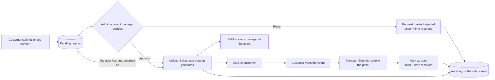

# Coupon Request Manager

**A WordPress plugin for running event-based discount campaigns — customers request a coupon, admins or event managers approve it, and everything is delivered and verified by SMS.**


-0d2846)

Coupon Request Manager turns a simple "get a discount code" button on your site into a complete, auditable workflow:

1. A customer enters their mobile number to request a discount for an event.
2. An administrator — **or the event's own manager, from a dedicated front-end panel** — approves or rejects the request. A manager can also switch on **auto-approve**, after which the server approves requests by itself, even while the manager is offline.
3. On approval, a unique 8-character coupon code is generated and sent by SMS to the customer and to every manager of that event.
4. When the customer shows up, the manager looks the code up on their phone and marks it as used. No WordPress login required.
5. Every important action is written to an audit trail that administrators can browse and filter on the **Reports** screen.

> **Language note:** the user interface (customer form, manager panel, admin screens) is written in Persian, laid out right-to-left, and shows dates in the **Jalali (Shamsi) calendar**. SMS delivery is built for [Melipayamak](https://www.melipayamak.com/) and Iranian mobile numbers. See [Known limitations](#known-limitations).

---

## Table of contents

- [Features](#features)
- [How it works](#how-it-works)
- [Requirements](#requirements)
- [Installation](#installation)
- [Configuration](#configuration)
  - [1. SMS gateway settings](#1-sms-gateway-settings)
  - [2. Melipayamak templates](#2-melipayamak-templates)
  - [3. Create an event](#3-create-an-event)
  - [4. Add the shortcodes to your pages](#4-add-the-shortcodes-to-your-pages)
- [Usage](#usage)
  - [For customers](#for-customers)
  - [For administrators](#for-administrators)
  - [For event managers](#for-event-managers)
- [Shortcode reference](#shortcode-reference)
  - [Using your own button (page builders)](#using-your-own-button-page-builders)
- [Auto-approve](#auto-approve)
- [Reports (audit log)](#reports-audit-log)
- [Jalali (Shamsi) dates](#jalali-shamsi-dates)
- [Security model](#security-model)
- [Database schema](#database-schema)
- [Developer guide](#developer-guide)
- [Troubleshooting](#troubleshooting)
- [Known limitations](#known-limitations)
- [Roadmap](#roadmap)
- [Contributing](#contributing)
- [Changelog](#changelog)

---

## Features

### Customers
- One-tap **"get discount code"** button that opens a modal request form (shortcode) — or open the same modal from **your own button or link** built in Elementor or any page builder.
- Iranian mobile number validation, with automatic normalization of Persian/Arabic digits and `+98` / `0098` / `98` prefixes.
- Duplicate protection — a customer cannot have two pending requests for the same event.
- Modal closes with the **Esc** key and locks page scroll while open.
- Coupon delivered by SMS as soon as it is approved.

### Administrators
- **Requests list** with search (phone, event name or **request ID**) and status filtering (pending / approved / rejected); approve or reject in one click.
- **Events management** — name, discount percentage, **Jalali expiry date with a built-in date picker**, availability toggle, and one or more managers per event.
- **Safe event removal** — an event that already has requests or issued coupons is **deactivated instead of deleted**, so history is never lost.
- **Issued coupons list** with search, plus **Retry SMS** and **Mark as used** actions.
- **Reports screen** — a searchable, filterable audit log of logins, approvals, rejections, coupon usage, SMS failures and event changes, with deep links back to the related request, event or coupon.
- **Melipayamak settings** screen — username, password and three template IDs, all configurable from the dashboard (nothing is hard-coded).
- All dates shown in the admin are displayed in the **Jalali calendar**.

### Event managers (no WordPress account needed)
- **Phone number + SMS one-time-code login** — managers never touch `wp-admin`.
- A mobile-first, RTL front-end panel placed on any page with a single shortcode.
- **Dashboard counters:** pending requests, approved requests, unused coupons, coupons used today.
- **Requests tab:** search by customer phone, filter by status and **Jalali date**, approve or reject.
- **Auto-approve toggle** («تایید خودکار درخواست ها») above the requests table: while it is on, every request for the manager's events is approved automatically **on the server**, even if the manager has closed the panel. See [Auto-approve](#auto-approve).
- **Coupons tab:** search by coupon code or customer phone, filter used/unused, **mark as used** with one tap.
- **Multiple managers per event:** every assigned manager receives the coupon SMS and can log in; each sees only the events they are assigned to.

### Under the hood
- Server-side ownership checks on every manager action — knowing an ID is never enough.
- Hashed, rate-limited, single-use login codes and hashed session tokens (see [Security model](#security-model)).
- **Audit log** recording *who* did *what* and *when* — approvals (manual and automatic), rejections, usage, SMS retries and failures, manager logins/logouts, auto-approve switches, and event creation/edits.
- **Server-side auto-approval** driven by a submit-time hook plus WP-Cron, so it does not depend on any browser being open.
- **Race-safe approval:** the request row is locked while a coupon is issued, so a manual click and an automatic approval can never create two coupons for one request.
- **One consistent clock:** every stored timestamp and every expiry check uses the database server's time (`NOW()`), so PHP/WordPress timezone settings can no longer shift expiries or rate limits.
- Versioned database migrations that upgrade existing installations automatically.

---

## How it works



Two kinds of people can act on a request or coupon:

| Actor | Signs in with | Works in | Sees |
|---|---|---|---|
| **Administrator** | WordPress account (`manage_options`) | `wp-admin` | Everything |
| **Event manager** | Phone number + SMS code | Front-end panel (`[crm_manager_panel]`) | Only their own events |

---

## Requirements

| Component | Minimum |
|---|---|
| PHP | 7.3 (uses `setcookie()` options array and `random_int()`) |
| WordPress | 5.0 |
| MySQL / MariaDB | MySQL 5.7 / MariaDB 10.3 or newer recommended (uses `GET_LOCK()`, `NOW()` and `DATETIME` defaults) |
| SMS provider | A [Melipayamak](https://www.melipayamak.com/) account with **pattern (template) based** sending |
| Network | Outbound HTTPS access to `rest.payamak-panel.com` |
| Scheduler | **WP-Cron** (the WordPress default) for background auto-approve. If your host sets `DISABLE_WP_CRON`, call `wp-cron.php` from a real server cron instead. Approval of *new* requests at submission time does not need cron |
| Browser | A current browser with `Intl` Persian-calendar support (all modern Chrome, Edge, Firefox and Safari) — needed to render Jalali dates and the date picker |
| Site | HTTPS strongly recommended (the manager session cookie is marked `Secure` on HTTPS) |

---

## Installation

The plugin folder **must be named `coupon-request-manager`**.

### Option A — Clone directly (recommended for developers)

```bash
cd wp-content/plugins
git clone https://github.com/Nifa-codes/custom-coupon-request-manager.git coupon-request-manager
```

Passing the folder name as the last argument guarantees the correct directory name, because the repository itself is called `custom-coupon-request-manager`.

### Option B — Upload a ZIP

1. Create a ZIP whose top-level folder is `coupon-request-manager` and which contains `coupon-request-manager.php`, `includes/` and `assets/`.
2. In WordPress go to **Plugins → Add New → Upload Plugin**, choose the ZIP, and click **Install Now**.

> **Heads-up:** GitHub's *Code → Download ZIP* produces a folder named `custom-coupon-request-manager-main`. Rename it to `coupon-request-manager` before zipping, or WordPress will install it under the wrong directory name.

### Activate

Click **Activate** on the Plugins screen. Activation creates all database tables automatically. If you ever restore a database backup or replace the plugin files, see [Tables are missing after a restore](#tables-are-missing-after-a-database-restore-or-update).

### Upgrading from 1.0.0 – 1.0.3

Replace the plugin files and load any page. There is **no schema change** (`CRM_DB_VERSION` stays `1.2.0`), so nothing needs to be migrated. Existing events, requests, coupons and audit rows keep working; the Reports screen simply starts showing the audit rows that already exist.

Version 1.0.4 registers its background job (a recurring WP-Cron event) automatically on the first page load after the update — no re-activation is needed. Auto-approve is **off** for every manager until they switch it on.

---

## Configuration

### 1. SMS gateway settings

Go to **درخواست‌های تخفیف → تنظیمات ملی‌پیامک** (*Coupon requests → Melipayamak settings*) and fill in:

| Field | Option name | Purpose |
|---|---|---|
| Username | `crm_melipayamak_username` | Melipayamak account username |
| Password | `crm_melipayamak_password` | Melipayamak account password |
| Customer template ID | `crm_melipayamak_body_id_customer` | Message that delivers the coupon to the customer |
| Manager template ID | `crm_melipayamak_body_id_manager` | Message that notifies managers of a new coupon |
| Manager login template ID | `crm_melipayamak_body_id_manager_otp` | Message that carries the manager login code |

### 2. Melipayamak templates

Create three **pattern-based** templates in your Melipayamak panel and wait for them to be **approved** — an unapproved pattern may be accepted by the API but never delivered. Placeholders are positional, so **the order in your pattern must match the table below exactly**.

| Template | Placeholder `{0}` | Placeholder `{1}` |
|---|---|---|
| **Customer coupon** | Coupon code | Event name |
| **Manager notification** | Customer phone number | Coupon code |
| **Manager login code** | 6-digit login code | *(none — exactly one placeholder)* |

Example patterns (adapt the wording to your brand):

```text
Customer:  کد تخفیف شما: {0}  |  رویداد: {1}
Manager:   درخواست کننده: {0}  |  کد تخفیف: {1}
Login:     کد ورود شما به پنل مدیر رویداد: {0}
```

> If you need to change the argument order to fit an existing template, edit the `$args` array in `CRM_Manager_Ajax::request_otp()` (login code) or in `CRM_DB::approve_request()` (customer and manager messages).

### 3. Create an event

Go to **درخواست‌های تخفیف → لیست رویدادها** (*Events*) and add an event:

| Field | Description |
|---|---|
| Name | Shown to customers in the request modal |
| Discount value | Percentage, shown as "N درصد" |
| Manager phone numbers | **One or more** Iranian mobile numbers — separate with new lines, commas or semicolons. Every number becomes a manager of this event |
| Expiry date | **Jalali** date and time (e.g. `1405-07-06 18:50`). Pick it from the calendar or type it; Persian digits are accepted. Leave empty for no expiry. After this moment the event no longer accepts requests |
| Availability | Toggle to pause an event without deleting it |

Manager numbers are normalized and de-duplicated on save. A manager who is assigned to several events sees all of them in a single panel. An invalid Jalali date is rejected with an error and nothing is saved.

**Deleting an event.** If the event has no requests and no coupons it is removed together with its manager assignments. If it has **any** requests or issued coupons, it is **not** deleted — it is switched to *unavailable* instead, and the screen tells you so. The change is recorded in the audit log.

### 4. Add the shortcodes to your pages

| Page | Shortcode |
|---|---|
| Public page where customers request a coupon (button + modal) | `[coupon_request_form]` |
| Public page where you supply your own button (modal only) | `[coupon_request_modal]` |
| A separate page for event managers | `[crm_manager_panel]` |

Keep the customer and manager shortcodes on **separate pages** — each loads its own CSS/JS bundle. The manager page can be left out of your navigation menu; access is controlled by the SMS login, not by page visibility. See [Shortcode reference](#shortcode-reference) for options and caching advice.

---

## Usage

### For customers

1. Click **دریافت کد تخفیف** on the page.
2. Enter a mobile number (`09xxxxxxxxx`) and submit.
3. Wait for approval. The coupon code arrives by SMS.

### For administrators

Everything lives under the **درخواست‌های تخفیف** menu in `wp-admin`:

- **لیست درخواست‌ها** — review pending requests; approve or reject. Search by phone, event name or request ID.
- **لیست رویدادها** — create, edit and remove events and their managers. Expiry dates use the Jalali picker.
- **کدهای تخفیف صادر شده** — search issued coupons, **retry** a failed SMS, or **mark as used**.
- **گزارش ها** — the audit log. See [Reports](#reports-audit-log).
- **تنظیمات ملی‌پیامک** — gateway credentials and template IDs.

Approving a request generates the coupon, records who approved it, and sends the SMS messages. If SMS delivery fails, the coupon still exists, the failure is written to the audit log, and a **Retry** button appears in the coupons list.

### For event managers

1. Open the manager page and enter the phone number registered on the event.
2. Enter the 6-digit code received by SMS. The code is valid for **3 minutes**.
3. Use the panel:
   - **Dashboard** — live counters at the top.
   - **Requests** — approve or reject requests for your events. The date filter takes a **Jalali** date (e.g. `1405-07-09`); request dates are shown in Jalali. Above the table, the **«تایید خودکار درخواست ها»** switch turns [auto-approve](#auto-approve) on or off (hover it for a short explanation).
   - **Coupons** — type a coupon code or customer phone number, then tap **Mark as used** when the customer redeems it.

The session lasts **24 hours** on that device, so a page reload doesn't log you out. Use the logout button on shared devices.

---

## Shortcode reference

### `[coupon_request_form]`

Renders the request button **and** the modal.

| Attribute | Default | Description |
|---|---|---|
| `event_id` | `0` | Show a specific event. If omitted (or not found) the most recent available, non-expired event is used |

```text
[coupon_request_form]
[coupon_request_form event_id="3"]
```

If no event is currently active, a short "no active event" notice is shown instead of the button.

### `[coupon_request_modal]`

Renders **only the modal** — no button. Use it when the page already has a button or link that should open the request form (see below).

| Attribute | Default | Description |
|---|---|---|
| `event_id` | `0` | Same behaviour as `[coupon_request_form]` |

```text
[coupon_request_modal]
[coupon_request_modal event_id="3"]
```

If no event is currently active, the modal opens with a "no active event" message instead of the form.

> **Only one modal per page.** The modal uses fixed element IDs, so if a page contains several of these shortcodes only the first one prints its markup.

### Using your own button (page builders)

With `[coupon_request_modal]` on the page, **any** of these opens the modal:

| Trigger | Example |
|---|---|
| An element with the class `crm-open-modal` | `<button class="crm-open-modal">Get a code</button>` |
| A link whose URL is `#crm-open-modal` | `<a href="#crm-open-modal">Get a code</a>` |
| The built-in button of `[coupon_request_form]` | *(automatic)* |

In Elementor, set the button's **Link** to `#crm-open-modal`, or add `crm-open-modal` under *Advanced → CSS Classes*. Triggers are delegated, so they also work for buttons that appear later (popups, tabs, etc.).

To make a plain button or link look like the plugin's own button, add the optional class `crm-trigger-btn`.

Front-end assets are enqueued **by the shortcode itself**, so both shortcodes work in page builders where the page content can't be scanned for shortcodes. The modal is moved to `<body>` on load so builder wrappers (transforms, `overflow`, z-index) can't break its positioning.

### `[crm_manager_panel]`

Renders the manager login screen, or the panel when a valid session cookie is present. It takes no attributes.

> **Caching:** exclude the manager page from any page-cache or CDN cache (WP Rocket, LiteSpeed Cache, Cloudflare "Cache Everything", etc.). The page embeds a per-load nonce and reads the session cookie on the server; a cached copy causes stale nonces and a wrong initial screen.

---

## Auto-approve

Managers who don't want to approve every request by hand can switch on **«تایید خودکار درخواست ها»** at the top of the **Requests** tab. The tooltip reads: *«با فعالسازی این گزینه همه درخواست ها بصورت خودکار تایید خواهند شد.»*

The approval is performed **by the server**, not by the browser, so it keeps working after the manager closes the panel or logs out.

### What happens while it is on

| Situation | Behaviour |
|---|---|
| A customer submits a new request | The request is approved immediately, inside the same submission. The coupon is generated and the customer and manager SMS messages are sent exactly as for a manual approval |
| The manager turns the switch **on** while requests are already pending | Up to **10** pending requests are approved right away. Anything beyond that is approved by WP-Cron in batches of 10, and the panel reports how many are left |
| A request was missed (e.g. a temporary database error) | A recurring WP-Cron job runs **every 5 minutes** and approves whatever is still pending |
| The manager turns the switch **off** | Nothing further is auto-approved. Requests that are still pending stay pending for manual review. A background run that is already in progress stops at the next request |

### Rules

- **Per manager.** The setting belongs to the manager's phone number and applies to every event that manager is assigned to. If an event has several managers, auto-approve is active for it as soon as **any one** of them has it on. The first such manager (in assignment order) is recorded as the approver.
- **Active events only.** Only requests of events that are available **and** not expired are auto-approved. Pending requests of expired or deactivated events are left for manual handling.
- **Same outcome as a manual approval.** Auto-approval calls `CRM_DB::approve_request()` with actor type `manager`, so the coupon's *accepted by* field shows the manager's phone number, and SMS failures are logged and can be retried by an admin.
- **Safe under concurrency.** The request row is locked (`SELECT … FOR UPDATE`) and its status re-checked inside the approval transaction. A manual click, the submit-time approval and the background job can run at the same time and still issue exactly one coupon per request.
- **Never blocks the customer.** If automatic approval fails for any reason, the customer's submission still succeeds, the request stays `pending`, and the next background run retries it.
- **Audited.** Each automatic approval writes an `auto_approve_request` entry (in addition to the usual `approve_request` entry). Switching the option on or off writes `auto_approve_on` / `auto_approve_off`. All three appear on the [Reports](#reports-audit-log) screen.

### Where the setting is stored

One non-autoloaded option per manager: `crm_auto_approve_<normalized phone>` (value `1` when on; the option is deleted when switched off). No database schema change is involved.

### Background jobs

| Hook | Schedule | Purpose |
|---|---|---|
| `crm_auto_approve_sweep` | Every 5 minutes (`crm_five_minutes` schedule) | Approve pending requests for every manager who has auto-approve on |
| `crm_auto_approve_continue` | One-off, ~10 s after a batch that left work behind | Continue a large backlog in batches of 10 |

Both hooks run the same function and are serialized with a MySQL `GET_LOCK()`, so overlapping runs cannot double-process. The recurring job is registered automatically and removed when the plugin is deactivated.

---

## Reports (audit log)

**درخواست‌های تخفیف → گزارش ها** lists every audited action, newest first, 20 per page.

**Filters**

| Filter | Matches |
|---|---|
| Search | Event name, manager phone number (current or assigned), or the person who acted |
| Operation type | One of the actions below |
| From / To date | Inclusive date range (**Gregorian** date inputs — see [Known limitations](#known-limitations)) |

**Recorded actions**

| Label | Key | Written when |
|---|---|---|
| تایید درخواست | `approve_request` | An admin or manager approves a request |
| رد درخواست | `reject_request` | An admin or manager rejects a request |
| استفاده از کوپن | `mark_coupon_used` | A coupon is marked as used |
| ارسال مجدد پیامک به مشتری | `retry_sms` | An admin re-sends a coupon SMS and the customer message succeeds |
| پیامک ناموفق | `sms_failed` | A coupon SMS (on approval or on retry) or a manager login-code SMS fails to send |
| ورود مدیر | `manager_login` | A manager signs in with a valid code |
| خروج مدیر | `manager_logout` | A manager logs out |
| ایجاد رویداد | `event_created` | An admin creates an event |
| ویرایش رویداد | `event_updated` | An admin changes an event's name, discount, availability, expiry or managers — or an event is auto-deactivated instead of deleted. Before/after values are stored |
| تایید خودکار درخواست | `auto_approve_request` | A request is approved automatically by the server (written together with the normal `approve_request` entry; the actor is the manager who has auto-approve on) |
| فعال‌سازی تایید خودکار | `auto_approve_on` | A manager switches auto-approve on |
| غیرفعال‌سازی تایید خودکار | `auto_approve_off` | A manager switches auto-approve off |

**Linked targets.** The *Target* column links to the related object: a request opens the Requests list filtered to that request, an event opens the Events list filtered to that event, and a coupon opens the Coupons list searched by its code. If the coupon no longer exists, the cell reads "کوپن حذف‌شده" (deleted coupon).

> Login, logout, login-code failures and auto-approve on/off switches are attributed to the manager's **first assigned event**, because they aren't tied to one particular event.

---

## Jalali (Shamsi) dates

Dates are **stored** exactly as before (Gregorian `DATETIME` values in the database server's time) and **displayed** in the Jalali calendar.

| Where | What changed |
|---|---|
| Admin lists (requests, events, coupons) | Created / expiry / used-at cells are rendered as Jalali in the browser |
| Event form — expiry | A text field with a Jalali calendar picker (year/month/day views and an optional time). Typed input accepts `-` or `/` separators and Persian, Arabic or Latin digits |
| Manager panel — request dates | Shown in Jalali |
| Manager panel — date filter | Takes a Jalali date; the server converts it to Gregorian for the query. An invalid date returns "تاریخ شمسی معتبر نیست" |

**Server side:** `CRM_Jalali_Date::to_sql()` validates the date (including Jalali leap years, month lengths and the 00:00–23:59 time range) and converts it to a Gregorian SQL datetime **without any timezone shift** — what you type is the wall-clock time that is stored. It returns `null` for anything invalid.

**Client side:** `assets/js/jalali.js` uses the browser's built-in `Intl` Persian calendar for display and ships its own Jalali → Gregorian arithmetic for the picker.

If JavaScript is unavailable, date cells fall back to the raw Gregorian value instead of breaking.

---

## Security model

| Area | Implementation |
|---|---|
| **Manager login codes** | Random 6-digit code from `random_int()`. Only an HMAC-SHA256 hash (keyed with `wp_salt('auth')`) is stored — never the code itself |
| **Code lifetime & limits** | Valid for 3 minutes · maximum 5 verification attempts · 60-second resend cooldown · maximum 7 requests per hour per phone |
| **Single use** | A code is consumed by one atomic conditional `UPDATE`; two simultaneous verifications of the same code cannot both succeed |
| **Race protection** | A per-phone MySQL `GET_LOCK()` serializes concurrent code requests so the cooldown and hourly cap cannot be bypassed by parallel requests |
| **Failed SMS sends** | The code is invalidated, but the request record is **kept** so failures still count towards the rate limits. The failure is also written to the audit log |
| **Sessions** | 256-bit random token; only its SHA-256 hash is stored server-side. Delivered in an `HttpOnly`, `SameSite=Lax` cookie (`Secure` over HTTPS) valid for 24 hours |
| **Identity** | The manager's phone is always derived from the server-side session — a phone number sent in a request is never trusted for authorization. Access ends immediately if the manager is removed from all events |
| **Ownership** | Every approve, reject and mark-used action verifies the manager is assigned to that request's/coupon's event before doing anything |
| **State checks** | Only requests that are still `pending` can be approved or rejected. Approval re-checks the status under a row lock (`FOR UPDATE`), so concurrent manual and automatic approvals cannot issue duplicate coupons |
| **Auto-approve** | The switch is toggled through the same session-authenticated, nonce-protected manager endpoint as every other manager action; the phone is taken from the server-side session. Automatic approvals are limited to the managers' own active events and are audited |
| **CSRF** | Separate nonces for the public form, admin screens and manager panel. Deleting an event is a **`POST` form with its own nonce** (previously a `GET` link), so it can't be triggered by a link, prefetch or crawler |
| **Data integrity** | Event removal re-checks for requests and coupons **inside the transaction** (row-locked with `FOR UPDATE`) and rolls back if any exist, so a request that arrives mid-delete can't be orphaned |
| **Time source** | Expiry, rate-limit and session checks all compare against the database clock (`NOW()`), never against PHP/WordPress time |
| **SQL** | All queries use `$wpdb->prepare()`; interpolated IDs come from integer-cast values; report filters are whitelisted or validated (`action` against known keys, dates with `checkdate()`) |
| **XSS** | Manager panel renders all data through `.text()` — no raw HTML injection. Admin tables escape every value, including the audit `details` |
| **Auditing** | Actions are written to `coupon_manager_audit` with actor, event, target, details and timestamp, and are browsable on the Reports screen |

---

## Database schema

Seven tables are created with your WordPress table prefix (shown here as `wp_`). Schema changes are applied through `dbDelta()` plus guarded `ALTER TABLE` migrations. **Versions 1.0.3 and 1.0.4 add no tables or columns** — `CRM_DB_VERSION` is still `1.2.0`. (The auto-approve setting lives in `wp_options`, see [Auto-approve](#where-the-setting-is-stored).)

| Table | Purpose |
|---|---|
| `wp_coupon_available_events` | Events: name, discount %, expiry, availability, legacy `event_manager_phone` |
| `wp_coupon_event_managers` | Event ↔ manager membership (many-to-many, unique per `event_id` + `manager_phone`) |
| `wp_coupon_pending_requests` | Customer requests with status (`pending` / `approved` / `disapproved`) and rejection attribution |
| `wp_coupon_coupons` | Issued coupons: code, usage state and timestamp, who approved, who used, SMS-sent flag |
| `wp_coupon_manager_otps` | Manager login codes (hash only), expiry, attempt count — also the rate-limit history |
| `wp_coupon_manager_sessions` | Manager sessions (token hash only) with expiry |
| `wp_coupon_manager_audit` | Audit trail of actions by admins and managers; read by the Reports screen |

`coupon_available_events.event_manager_phone` is a **legacy compatibility column**. It is kept in sync with the first manager and is still honoured as a fallback, so events created before multi-manager support keep working.

---

## Developer guide

### Repository layout

```text
coupon-request-manager/
├── coupon-request-manager.php        # Bootstrap: constants, includes, activation, migrations, asset enqueue
├── includes/
│   ├── class-db.php                  # CRM_DB — all table definitions, migrations, data access, sql_now()
│   ├── class-jalali-date.php         # CRM_Jalali_Date::to_sql() — Jalali → Gregorian SQL datetime
│   ├── class-phone-helper.php        # CRM_Phone_Helper::normalize() — the only phone normalizer
│   ├── class-coupon-generator.php    # CRM_Coupon_Generator — unique 8-character codes
│   ├── class-melipayamak.php         # CRM_Melipayamak — SMS gateway client
│   ├── class-auto-approve.php        # CRM_Auto_Approve — per-manager auto-approve setting, submit hook, WP-Cron sweep
│   ├── class-ajax.php                # CRM_Ajax — public request form + admin AJAX
│   ├── class-manager-ajax.php        # CRM_Manager_Ajax — manager login, session and panel endpoints
│   ├── class-admin.php               # CRM_Admin + list tables — wp-admin screens and actions
│   ├── class-reports-table.php       # CRM_Reports_List_Table — audit log list table
│   ├── class-shortcode.php           # [coupon_request_form] and [coupon_request_modal]
│   └── class-manager-shortcode.php   # [crm_manager_panel]
└── assets/
    ├── css/  admin.css · frontend.css · manager.css
    ├── js/   admin.js  · frontend.js  · manager.js · jalali.js
    └── icons/discount-icon.svg
```

### AJAX endpoints

| Action | Nonce | Access | Purpose |
|---|---|---|---|
| `crm_submit_request` | `crm_frontend_nonce` | Public | Submit a coupon request |
| `crm_retry_otp` | `crm_admin_nonce` | `manage_options` | Re-send coupon SMS |
| `crm_mark_coupon_used` | `crm_admin_nonce` | `manage_options` | Mark a coupon used (admin) |
| `crm_manager_request_otp` | `crm_manager_nonce` | Public | Send a login code to a registered manager |
| `crm_manager_verify_otp` | `crm_manager_nonce` | Public | Verify the code and start a session |
| `crm_manager_logout` | `crm_manager_nonce` | Session | End the session |
| `crm_manager_get_dashboard` | `crm_manager_nonce` | Session | Dashboard counters |
| `crm_manager_get_requests` | `crm_manager_nonce` | Session | List/filter the manager's requests (date filter is Jalali). The response also carries `auto_approve` (bool) to restore the toggle |
| `crm_manager_set_auto_approve` | `crm_manager_nonce` | Session | Turn auto-approve on/off (`enabled=1\|0`). When turning on, approves a first batch of pending requests and returns `{enabled, approved, remaining}` |
| `crm_manager_approve_request` | `crm_manager_nonce` | Session + ownership | Approve a request |
| `crm_manager_disapprove_request` | `crm_manager_nonce` | Session + ownership | Reject a request |
| `crm_manager_get_coupons` | `crm_manager_nonce` | Session | List/search the manager's coupons |
| `crm_manager_mark_coupon_used` | `crm_manager_nonce` | Session + ownership | Mark a coupon used |

Manager endpoints are registered for both `wp_ajax_` and `wp_ajax_nopriv_` because managers are not WordPress users; authorization is the session + ownership check inside each handler. Admin approve/reject actions are nonce-protected `GET` links handled on `admin_init`; **event deletion is a nonce-protected `POST`** from the Events list.

### Admin screens

| Menu slug | Screen |
|---|---|
| `coupon-request-manager` | Requests |
| `crm-events` | Events |
| `crm-coupons` | Issued coupons |
| `crm-reports` | Reports (audit log) |
| `crm-settings` | Melipayamak settings |

The Requests and Events lists accept `audit_request_id` / `audit_event_id` query arguments (used by the Reports deep links) to filter to a single row. Admin CSS/JS load on every screen whose hook contains `coupon-request-manager` or `crm`.

### Shared business logic

Approve, reject and mark-used are implemented once and shared by the admin screens and the manager panel:

- `CRM_DB::approve_request( $request_id, $actor_type, $identifier )`
- `CRM_DB::disapprove_request( $request_id, $actor_type, $identifier )`
- `CRM_DB::mark_coupon_as_used( $coupon, $datetime, $used_by_phone, $used_by_role )`
- `CRM_DB::insert_manager_audit( $actor, $event_id, $action, $target_type, $target_id, $details )`
- `CRM_DB::sql_now()` — the database server's current `DATETIME`; use it for **every** timestamp you store or compare

`$actor_type` is `'admin'` or `'manager'`; attribution and audit rows are written automatically. `approve_request()` locks the request row and returns a `WP_Error` with code `invalid_request` if it is no longer pending.

Auto-approve lives in `CRM_Auto_Approve`:

- `CRM_Auto_Approve::is_enabled( $phone, $fresh = false )` / `set_enabled( $phone, $enabled )` — the per-manager switch (`$fresh` bypasses the options cache, for long-running loops)
- `CRM_Auto_Approve::maybe_approve_new_request( $request_id )` — called from `CRM_Ajax::handle_submit_request()` right after the request is stored; never throws
- `CRM_Auto_Approve::approve_pending_for_phone( $phone, $limit )` — approves up to `$limit` pending requests of that manager's active events; returns `['approved' => n, 'remaining' => n]`
- `CRM_Auto_Approve::run_cron()` — the background sweep (also the callback of the continuation event)
- `CRM_DB::manager_event_ids( $phone )` — now public; returns the IDs of all events a manager is assigned to

### Adding an audit action

1. Call `CRM_DB::insert_manager_audit()` with a new action key.
2. Add the key and its Persian label to `CRM_Reports_List_Table::action_labels()`. This list also whitelists the Reports filter, so an action missing from it is displayed raw and can't be filtered on.
3. If `target_type` is something new, handle it in `CRM_Reports_List_Table::target()`.

### Jalali helpers

- **PHP:** `CRM_Jalali_Date::to_sql( string $value ): ?string` — accepts `YYYY-MM-DD HH:MM[:SS]` (separator `-` or `/`, any digit script, years 1000–1700); returns a Gregorian `Y-m-d H:i:s` string or `null`.
- **JavaScript:** `window.CRMJalali = { format, initPicker }`. On page load it automatically formats every `.crm-jalali-datetime` element from its `data-sql-datetime` attribute and turns every `.crm-jalali-input` into a picker (`data-sql-datetime` = initial value, `data-today` = server date).
- The script handle is `crm-jalali-js`; the admin and manager scripts depend on it.

### Options

`crm_melipayamak_username`, `crm_melipayamak_password`, `crm_melipayamak_body_id_customer`, `crm_melipayamak_body_id_manager`, `crm_melipayamak_body_id_manager_otp`, `crm_db_version`, and one `crm_auto_approve_<phone>` option per manager who has auto-approve switched on.

### Database versioning

`CRM_DB_VERSION` is compared with the stored `crm_db_version` option on `plugins_loaded`; when they differ, `create_tables()` and `migrate()` run and the option is updated. Activation always runs both unconditionally. **Any schema change must bump `CRM_DB_VERSION` and be made idempotent** (check with `column_exists()` / `table_exists()` before altering). `CRM_PLUGIN_VERSION` (the plugin version, used for asset cache-busting) is separate and must match the `Version:` header in `coupon-request-manager.php`.

### Conventions

- All data access is static methods on `CRM_DB`, using `$wpdb->prepare()` placeholders.
- `CRM_Phone_Helper::normalize()` is the **single** phone normalizer — never re-implement it.
- Every AJAX handler starts with `check_ajax_referer()` and answers with `wp_send_json_success()` / `wp_send_json_error()`.
- Multi-step writes use explicit `START TRANSACTION` / `COMMIT` / `ROLLBACK`.
- Anything that approves a request goes through `CRM_DB::approve_request()` — never insert coupons directly — so locking, attribution, SMS and auditing stay consistent.
- **All time values come from the database clock.** Store with `CRM_DB::sql_now()` and compare with SQL `NOW()`. Do **not** use `current_time('mysql')`, `wp_date()` or PHP `date()` for stored timestamps or expiry comparisons — mixing clocks causes timezone drift.
- Dates are **stored Gregorian, shown Jalali.** Convert user-typed Jalali input with `CRM_Jalali_Date::to_sql()` on the server; render stored values in tables as `<time class="crm-jalali-datetime" data-sql-datetime="…">`.
- `wp_localize_script()` object names and JS references must match exactly (`crm_data`, `crm_admin_data`, `crm_manager_data`, each with `ajax_url` and `nonce`).
- Destructive admin actions use `POST` plus a nonce, not `GET` links.
- User-facing strings are Persian and every screen is RTL.

---

## Troubleshooting

### Tables are missing after a database restore or update

Restoring a backup can leave `crm_db_version` at a value that no longer reflects the tables. To force the migration to run again: in `wp_options`, delete the row where `option_name = 'crm_db_version'`, then load any page on the site once. Verify that all seven tables exist and that `coupon_manager_audit` has an `actor_identifier` column.

### My own button doesn't open the request form

- Make sure `[coupon_request_modal]` (or `[coupon_request_form]`) is on the **same page**.
- The button must have the class `crm-open-modal`, or be a link to exactly `#crm-open-modal`.
- Only one modal prints per page; if you see none, check that the shortcode isn't being stripped by a builder widget.

### The date picker doesn't appear, or dates show in Gregorian

The Jalali display needs JavaScript and a browser with Persian-calendar `Intl` support. Check the browser console for errors and for a blocked `jalali.js` (some optimizer/minifier plugins break it). On the Events screen you can always **type** the expiry as `1405-07-06 18:50`.

### "تاریخ شمسی انقضا معتبر نیست" when saving an event

The expiry could not be parsed. Use `YYYY-MM-DD HH:MM` (e.g. `1405-07-06 18:50`), with a real day for that month — month 12 has 30 days only in a Jalali leap year. Leave the field empty for no expiry.

### I clicked Delete on an event but it's still there

By design: an event that has requests or issued coupons is **deactivated, not deleted**, so history is preserved. The notice at the top of the screen says so. You can see the change on the Reports screen.

### Auto-approve is on but some requests are still pending

- The request belongs to an **expired or deactivated event** — auto-approve only handles active events.
- The manager who switched it on is **no longer assigned** to that event. The setting follows the manager's phone number and only applies to events they currently manage.
- A large backlog is being worked off in batches of 10. Wait a few minutes, or check that WP-Cron is running.
- **WP-Cron is disabled** (`DISABLE_WP_CRON`) and no server cron calls `wp-cron.php`. New requests are still approved at submission time, but the backlog and the 5-minute safety net won't run.
- Check the Reports screen and `debug.log` (look for `CRM auto-approve failed`).

### "کد منقضی شده یا تعداد تلاش‌ها تمام شده است" (code expired or attempts exhausted)

The code is valid for 3 minutes and allows 5 attempts. Request a new one after the cooldown.

### "سقف هفت درخواست در ساعت پر شده است" / a 60-second wait message

These are the intended rate limits (7 codes per hour per number, 60 seconds apart). While testing you can reset them by deleting your test number's rows from `wp_coupon_manager_otps`.

### The manager panel behaves oddly (wrong screen, security-check errors, logged out on reload)

- Exclude the manager page from page caching and CDN caching.
- Make sure your CDN/proxy does not strip cookies for that page.
- Use HTTPS so the `Secure` cookie is accepted.

### A phone number is rejected

Only Iranian mobile numbers are accepted (`09xxxxxxxxx`; Persian/Arabic digits and `+98` / `0098` / `98` prefixes are normalized automatically).

### I deleted the plugin and my data is still there

Intentional — see [Known limitations](#known-limitations).

---

## Known limitations

These are documented deliberately so you can plan around them.

- **Persian-only interface.** Strings are hard-coded in Persian; there is no translation catalog yet.
- **Melipayamak and Iranian mobile numbers only.** Other SMS providers and international numbers aren't supported.
- **Gateway credentials are stored in plain text** in `wp_options`, and the password field on the settings screen is pre-filled with the saved value. Restrict administrator access accordingly.
- **No rate limiting on the customer request form.** The manager login is rate-limited; the public form is not. If you expect abuse, add CAPTCHA or WAF/edge rate limiting in front of it.
- **No uninstall routine.** Deleting the plugin leaves its tables and options in the database.
- **Reports date filters are Gregorian.** The *From / To* fields on the Reports screen use the browser's native date input; the table itself shows the stored time, not a Jalali conversion.
- **Reports show audit details as raw JSON**, and keep no history beyond what the audit table holds (there is no pruning or export).
- **Jalali display depends on the browser.** Without JavaScript, or in a browser lacking Persian-calendar `Intl` support, tables show the stored Gregorian value.
- **Events with history can't be hard-deleted from the admin.** They are deactivated; removing them fully means deleting the rows in the database yourself.
- **One modal per page.** `[coupon_request_form]` and `[coupon_request_modal]` share one set of element IDs.
- **Auto-approve is all-or-nothing per manager.** It cannot be limited to selected events, and approves every request without any extra checks.
- **Auto-approve needs WP-Cron for backlogs.** New requests are approved instantly, but turning the switch on with a large backlog, and the 5-minute retry job, depend on WP-Cron running (low-traffic sites should add a real cron).
- **Customer message wording is unchanged.** After an automatic approval the customer still sees the standard "will be sent after review" confirmation, although the SMS arrives immediately.
- **Discounts are percentages only.**

---

## Roadmap

Ideas under consideration, not commitments:

- [ ] Internationalization (`.pot` file, translatable strings)
- [ ] Jalali date inputs and display on the Reports screen
- [ ] Optional data cleanup on uninstall
- [ ] Rate limiting / CAPTCHA for the customer request form
- [ ] CSV export of requests, coupons and reports
- [ ] Human-readable rendering of audit details
- [ ] Per-event auto-approve (instead of per-manager)
- [ ] Pluggable SMS providers
- [ ] QR-code coupon verification

---

## Contributing

Issues and pull requests are welcome.

1. Fork the repository and create a feature branch.
2. Follow the [conventions](#conventions) above — especially: static `CRM_DB` data access, the single phone normalizer, `CRM_DB::sql_now()` for timestamps, matching `wp_localize_script` names, and a `CRM_DB_VERSION` bump with an idempotent migration for any schema change.
3. Run `php -l` on every PHP file you touch.
4. Test the full flow on a real WordPress + MySQL install: customer request → approval (admin and manager) → SMS → manager login → mark as used → check the entries on the Reports screen.
5. Open a pull request describing what changed and how you tested it.

When reporting a bug, please include your PHP, WordPress and MySQL/MariaDB versions and any relevant `debug.log` output. **Never post real API credentials or customer phone numbers.**

---

## Changelog

### 1.0.4

**Added**
- **Auto-approve** — a «تایید خودکار درخواست ها» toggle above the table in the manager panel's **Requests** tab, with a hover tooltip. While on, all pending requests of the manager's events are approved by the server, even if the panel is closed:
  - new requests are approved at the moment they are submitted;
  - turning the switch on approves up to 10 existing pending requests immediately and the rest in the background;
  - a recurring WP-Cron job (every 5 minutes) retries anything that was missed.
- New class `includes/class-auto-approve.php` (`CRM_Auto_Approve`) and the `crm_manager_set_auto_approve` AJAX endpoint; `crm_manager_get_requests` now returns the current `auto_approve` state.
- New audit events: `auto_approve_request`, `auto_approve_on`, `auto_approve_off` (with Persian labels and filters on the Reports screen).

**Changed**
- `CRM_DB::approve_request()` now locks the request row (`FOR UPDATE`) and re-checks its status inside the transaction, so concurrent approvals cannot issue duplicate coupons.
- `CRM_DB::manager_event_ids()` is now public.
- Plugin header and `CRM_PLUGIN_VERSION` bumped to 1.0.4.

**Database:** no schema changes — `CRM_DB_VERSION` remains `1.2.0`. The setting is stored as one `crm_auto_approve_<phone>` option per manager.

### 1.0.3
Covers everything since the last documented release (1.0.0).

**Added**
- **Reports screen** (`گزارش ها`) — searchable, filterable, paginated audit log with deep links to the related request, event or coupon.
- **New audit events:** manager login and logout, SMS failures (coupon approval, SMS retry, manager login code), event creation, and event edits with before/after values.
- **Jalali (Shamsi) calendar** across the plugin: Jalali expiry picker on the event form, Jalali dates in admin lists and in the manager panel, and a Jalali date filter in the manager's Requests tab. New `class-jalali-date.php` and `assets/js/jalali.js`.
- **`[coupon_request_modal]` shortcode** — modal only, opened by any element with class `crm-open-modal` or a link to `#crm-open-modal`; optional `crm-trigger-btn` styling class.
- Request and event **search by numeric ID** in the admin lists.
- Close the request modal with **Esc**; page scroll is locked while it's open.

**Changed**
- **Event deletion is now safe:** events with any requests or issued coupons are deactivated instead of deleted (the check is repeated atomically inside the delete transaction). Deleting uses a nonce-protected `POST` form instead of a `GET` link.
- **Single clock:** all stored timestamps and all expiry, rate-limit and session checks now use the database server time (`NOW()` / `CRM_DB::sql_now()`) instead of `current_time()` / PHP timezone calculations.
- Event save now reports errors (event not found, invalid Jalali date, save failure) instead of failing silently, and verifies that manager assignment succeeded.
- `retry_sms` is now logged when the **customer** SMS succeeds, and records whether the manager SMS also went through.
- Front-end assets are enqueued by the shortcode itself, so the form works in page builders such as Elementor.
- The modal is moved to `<body>` on load so builder wrappers can't break its positioning.
- Events list: the search box form no longer wraps the table (avoids nested forms around the delete buttons).
- Manager login button now spans the full width of the card.

**Fixed**
- Admin stylesheet/script now load on the main Requests screen (the asset check matched the wrong menu slug).
- Rate-limit documentation corrected: the manager login allows **7** codes per hour, not 3.
- Plugin header and `CRM_PLUGIN_VERSION` are now the same version (they previously disagreed).

**Database:** no schema changes — `CRM_DB_VERSION` remains `1.2.0`.

### 1.0.0
- Initial public release.
- Customer coupon request form (`[coupon_request_form]`) with Iranian mobile validation and duplicate-request protection.
- Admin management of requests, events and issued coupons; SMS retry; mark-as-used.
- Melipayamak SMS integration with dashboard-configurable credentials and template IDs.
- **Event manager panel** (`[crm_manager_panel]`): SMS-code login, dashboard, request approval/rejection, coupon search and mark-as-used — mobile-first and RTL.
- Multiple managers per event with per-manager event scoping.
- Audit logging of approvals, rejections, usage and SMS retries.
- Versioned database migrations (`CRM_DB_VERSION` 1.2.0).

---

## Credits

Built for event-based discount campaigns in Persian-language WordPress sites. SMS delivery by [Melipayamak](https://www.melipayamak.com/).
